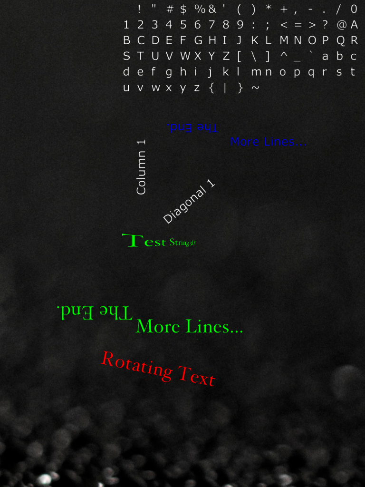
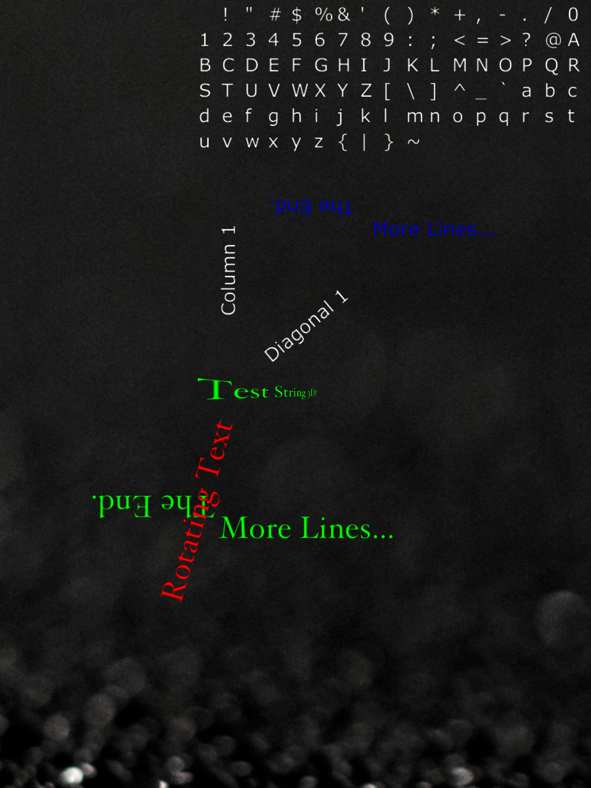
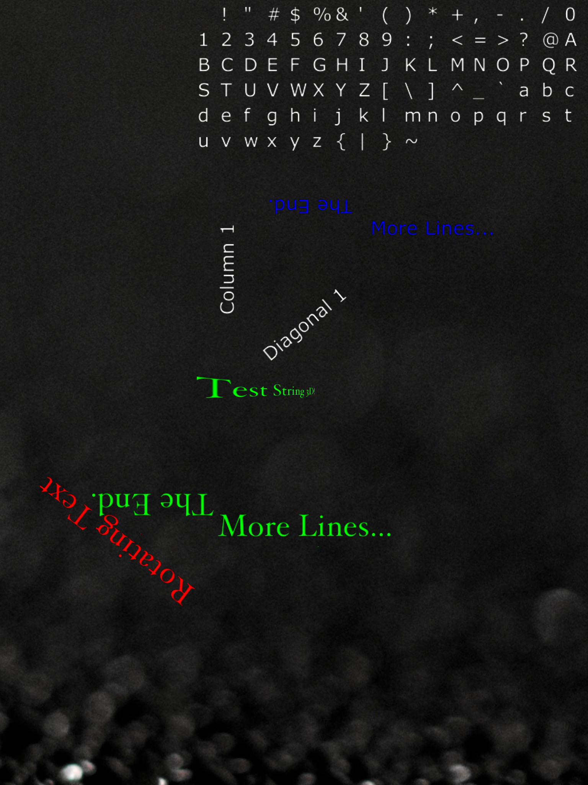

OpenGLESTextDemo iOS
====================

OpenGLES 2.0 Text Sprite Demo (for iOS)

Demo renders text using OpenGLES 2.0. This is a port of the code at https://github.com/d3alek/Texample2
to Swift/iOS. I updated it to use Core Text to create the font atlas and added vertex array, vertex buffer
and index buffer objects. Written in <b>Swift 2.2</b> using Xcode 7.3.1 and tested on iPad 2 running iOS 9.3.5.

You can read more about the original Texample2 project at https://primalpond.wordpress.com/2013/02/26/rendering-text-in-opengl-2-0-es-on-android/

    

The demo creates two GLText objects with different fonts and font sizes and renders text with them in various colors and orientations. 
One of the strings also uses the internal timer to rotate.